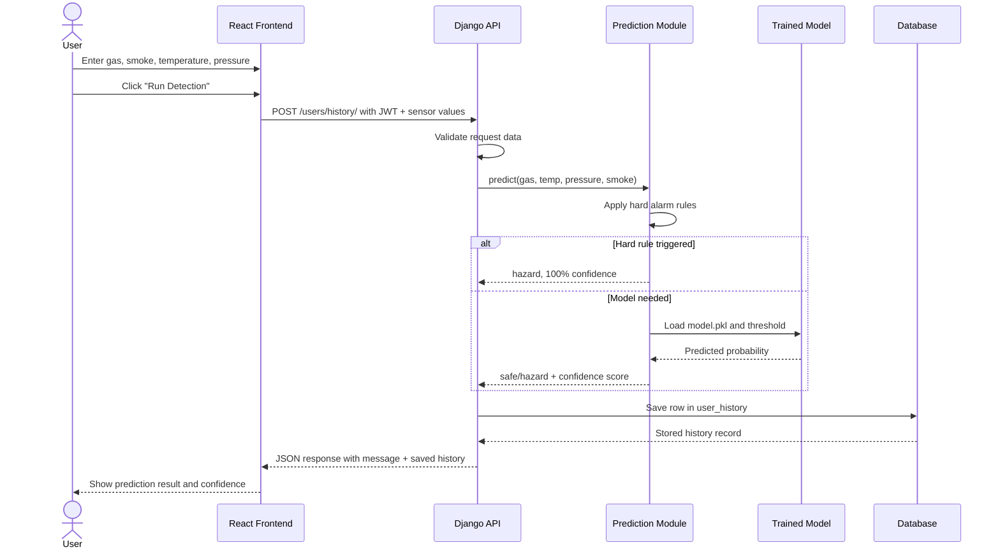
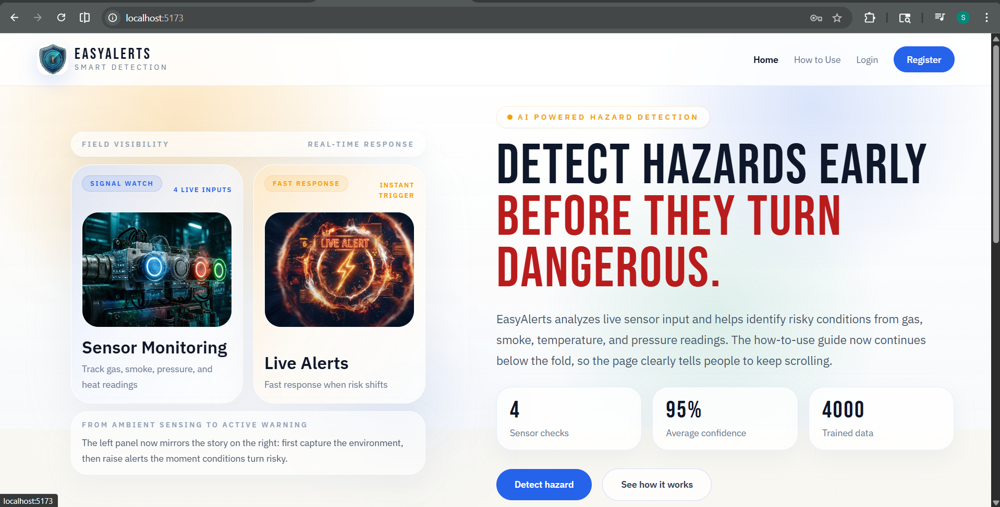
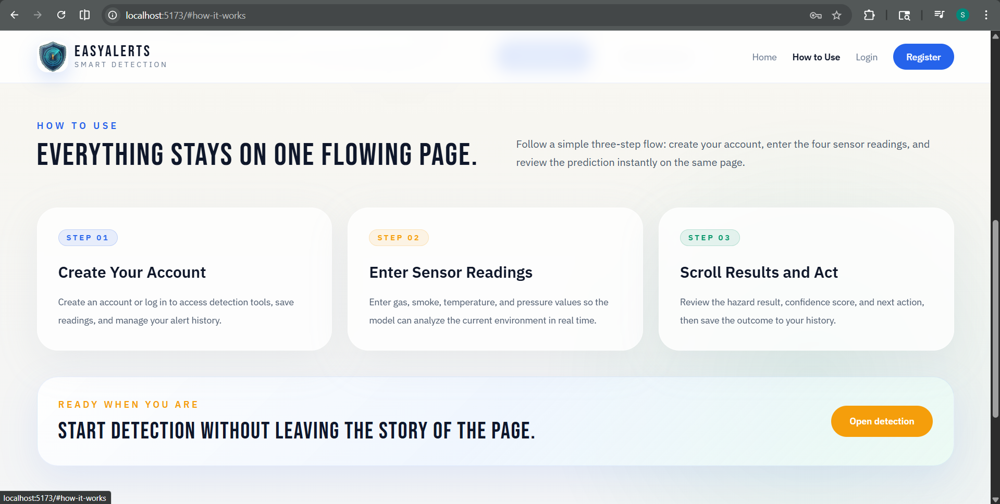
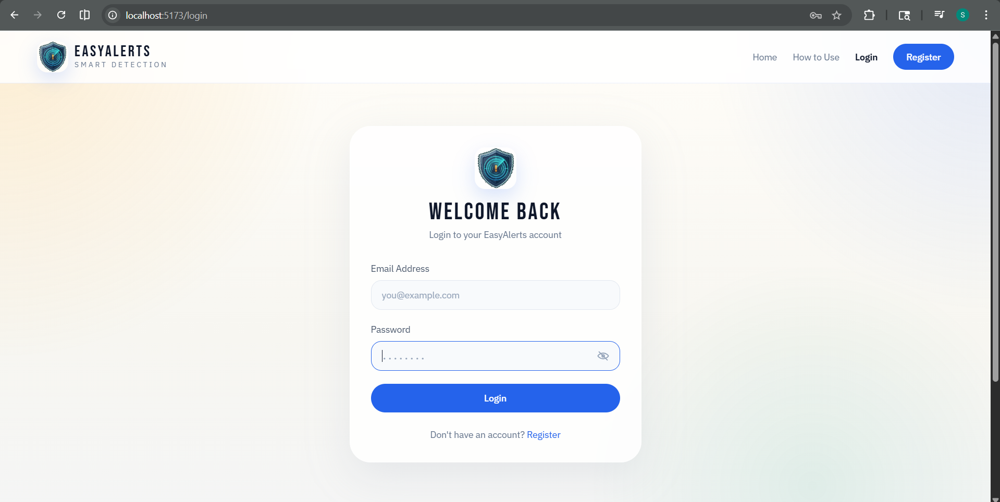
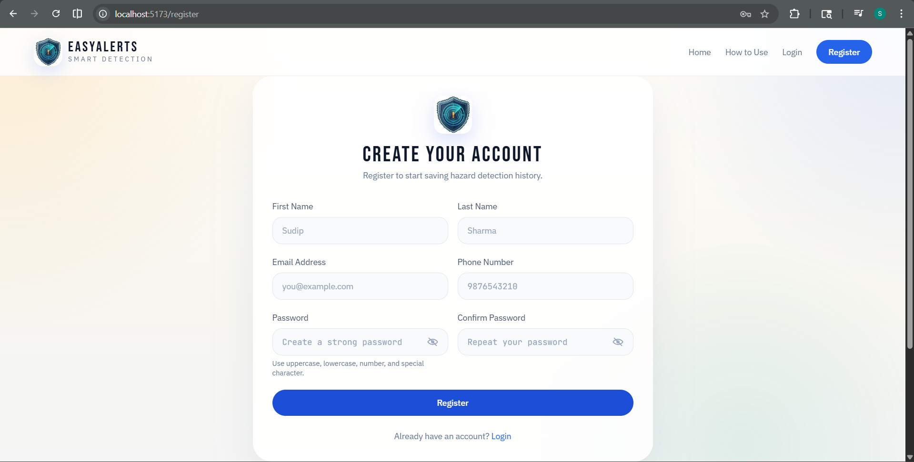
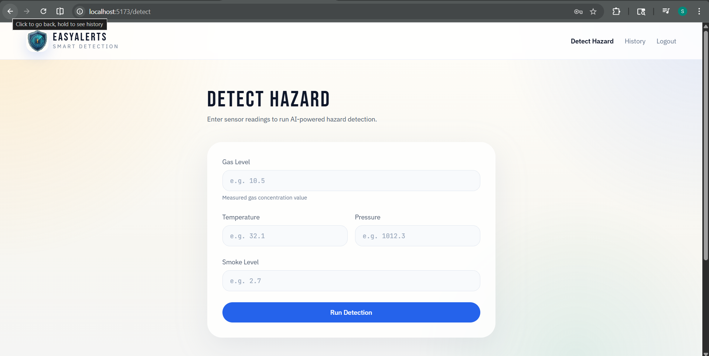
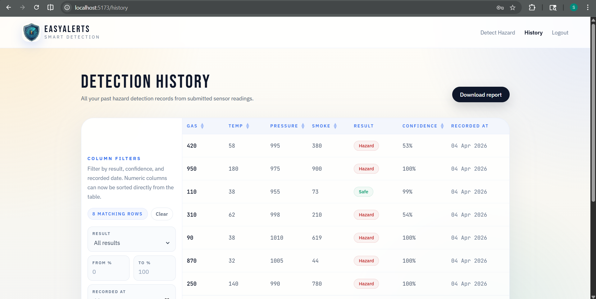

# EasyAlerts

EasyAlerts is a full-stack hazard detection system built with a Django REST API and a React + Vite frontend. It helps users submit four live sensor readings, run AI-assisted hazard detection, store results in history, and review past alerts from a clean dashboard.

The project combines authentication, prediction, history tracking, admin management, retraining utilities, and deployment-ready configuration in one repo.

## Table of Contents

- [Project Overview](#project-overview)
- [Key Features](#key-features)
- [Tech Stack](#tech-stack)
- [Project Structure](#project-structure)
- [How The System Works](#how-the-system-works)
- [Sequence Diagram](#sequence-diagram)
- [Main API Endpoints](#main-api-endpoints)
- [Local Setup](#local-setup)
- [Environment Variables](#environment-variables)
- [Model Training And Data Sync](#model-training-and-data-sync)
- [Deployment Notes](#deployment-notes)
- [Verification](#verification)
- [Frontend Screenshots](#frontend-screenshots)

## Project Overview

EasyAlerts is designed for smart hazard monitoring scenarios where gas, smoke, temperature, and pressure readings need to be evaluated quickly.

At a high level, the system works like this:

1. A user creates an account and logs in.
2. The user enters four sensor values from the frontend.
3. The Django backend validates the request and sends the values to the prediction module.
4. The ML layer applies hard safety rules plus the trained model to decide whether the reading is safe or hazardous.
5. The result is saved into `user_history`.
6. The frontend shows the prediction, confidence score, and saved detection timestamp.

The same project also includes a retraining workflow that can sync labeled history data back into the training table and retrain the model.

## Key Features

- User registration, login, logout, token refresh, and profile management
- JWT-based authentication with `djangorestframework-simplejwt`
- Real-time hazard detection from four sensor inputs
- Prediction confidence scoring
- Automatic storage of detection results in the history table
- User history view and admin history access
- Hard-rule safety overrides for high-risk edge cases
- ML retraining pipeline with MLflow logging
- Swagger/OpenAPI documentation
- Health check endpoint for deployment monitoring
- Django admin support for user management

## Tech Stack

### Frontend

- React 19
- Vite
- React Router
- Axios
- Tailwind CSS

### Backend

- Django 5
- Django REST Framework
- SimpleJWT
- drf-spectacular
- django-cors-headers

### Machine Learning And Data

- XGBoost
- scikit-learn
- pandas
- NumPy
- imbalanced-learn with SMOTE
- MLflow

### Database

- SQLite for simple local setup
- SQL Server support through `mssql-django`

## Project Structure

```text
EasyAlerts/
|-- backend/
|   |-- apps/
|   |   |-- user_profile/      # auth, profile, JWT flows
|   |   |-- history/           # hazard history APIs and model
|   |   |-- prediction/        # raw data, prediction logic, training pipeline
|   |-- easyalerts/            # Django project config, urls, settings
|   |-- resources/data/        # training CSV source
|   |-- logs/                  # application logs
|   |-- manage.py
|   |-- requirements.txt
|   |-- openapi-schema.yaml
|-- frontend/
|   |-- src/
|   |   |-- pages/             # Home, Register, Login, DetectHazard, History
|   |   |-- components/        # shared UI
|   |   |-- context/           # auth context
|   |   |-- config/            # API URL builder
|   |-- package.json
|-- docs/
|   |-- screenshots/           # place frontend screenshots here
|-- .env.example
|-- README.md
```

## How The System Works

### Authentication Flow

- Registration happens through `/users/register/`
- Login happens through `/users/login/`
- On successful login, the frontend stores the access token and refresh token in local storage
- Protected pages like detection and history require authentication

### Hazard Detection Flow

- The user opens the detection page
- The frontend sends four values:
  - `gas_level`
  - `temperature`
  - `pressure`
  - `smoke_level`
- The backend validates that the values are present and non-negative
- The prediction module:
  - creates interaction features such as `temp_gas` and `smoke_pressure`
  - applies hard alarm rules for obvious danger cases
  - loads the trained model from `backend/apps/prediction/ml/model.pkl`
  - calculates hazard probability and confidence
- The backend stores the final result in the `user_history` table
- The frontend shows the prediction label, confidence score, and timestamp

### History Flow

- Every prediction result is saved into the `History` model
- Users can fetch their own history from `/users/history/`
- Admin users can fetch all history from `/users/history/admin/`

### Retraining Flow

- Historical records with labels like `safe` and `hazard` can be synced into `raw_data`
- The `sync_and_retrain` command inserts new records into the training table
- The training pipeline retrains the XGBoost-based model and updates `model.pkl`

## Sequence Diagram

The sequence below shows the main hazard detection flow from the frontend to the database.



## Main API Endpoints

### Authentication

- `POST /users/register/` - register a new user
- `POST /users/login/` - login and receive JWT tokens
- `POST /users/token/refresh/` - refresh access token
- `POST /users/token/verify/` - verify token validity
- `POST /users/logout/` - blacklist refresh token

### User Profile

- `GET /users/profile/` - get authenticated user profile
- `PATCH /users/edit-profile/` - update authenticated user profile
- `GET /users/list/` - list users for admin accounts

### History

- `GET /users/history/` - get history for the logged-in user
- `POST /users/history/` - run detection and save result
- `GET /users/history/admin/` - get all history for admin users

### Health And Docs

- `GET /api/health/` - health check
- `GET /api/schema/` - OpenAPI schema
- `GET /api/docs/swagger/` - Swagger UI

## Local Setup

### Prerequisites

- Python 3.11+
- Node.js 22+
- npm
- Optional: SQL Server if you want to use MSSQL instead of SQLite

### 1. Clone The Repository

```powershell
git clone <your-repository-url>
cd EasyAlerts
```

### 2. Configure Environment Variables

Copy `.env.example` to `.env` and update values as needed.

```powershell
Copy-Item .env.example .env
```

### 3. Backend Setup

```powershell
cd backend
python -m venv .venv
.venv\Scripts\activate
pip install -r requirements.txt
python manage.py migrate
python manage.py check
python manage.py runserver
```

Backend default URL:

```text
http://localhost:8000
```

### 4. Frontend Setup

Open a new terminal:

```powershell
cd frontend
npm install
npm run dev
```

Frontend default URL:

```text
http://localhost:5173
```

### 5. API URL Configuration

The frontend reads the backend base URL from `VITE_API_URL`.

For local development:

```env
VITE_API_URL=http://localhost:8000
```

## Environment Variables

The project already includes `.env.example`. These are the most important settings:

- `DJANGO_SECRET_KEY` - Django secret key
- `DJANGO_DEBUG` - enables debug mode when `True`
- `DJANGO_ALLOWED_HOSTS` - allowed hosts for Django
- `EASYALERTS_DB_BACKEND` - `sqlite` or `mssql`
- `EASYALERTS_SQLITE_NAME` - SQLite file name when using SQLite
- `EASYALERTS_DB_NAME` - SQL Server database name
- `EASYALERTS_DB_HOST` - SQL Server host or instance
- `EASYALERTS_DB_DRIVER` - ODBC driver for SQL Server
- `JWT_ACCESS_TOKEN_LIFETIME_MINUTES` - access token lifetime
- `JWT_REFRESH_TOKEN_LIFETIME_DAYS` - refresh token lifetime
- `MLFLOW_DB_PATH` - MLflow SQLite DB location
- `MLFLOW_ARTIFACTS_DIR` - MLflow artifact directory
- `ENABLE_SYNC_AND_RETRAIN_CRON` - enables scheduled retraining
- `SYNC_AND_RETRAIN_CRON` - cron expression for retraining schedule
- `VITE_API_URL` - frontend API base URL

## Model Training And Data Sync

### Load Initial Training Data

The project includes `backend/resources/data/raw_data.csv`.

Use this command to load the CSV into the `raw_data` table:

```powershell
cd backend
python manage.py load_data
```

Important:

- This command clears the existing `raw_data` table before bulk loading the CSV

### Retrain The Model

To sync new labeled rows from `user_history` into `raw_data` and retrain the model:

```powershell
cd backend
python manage.py sync_and_retrain
```

### What The Training Pipeline Does

The training logic in `backend/apps/prediction/ml/train.py` performs the following:

1. Load rows from `raw_data`
2. Build features from gas, smoke, temperature, and pressure
3. Add interaction features:
   - `temp_gas`
   - `smoke_pressure`
4. Split train and test data
5. Apply SMOTE to reduce class imbalance
6. Train an XGBoost classifier
7. Calibrate probabilities
8. Sweep thresholds to reduce false negatives
9. Save the trained model to `model.pkl`
10. Log metrics and model artifacts to MLflow

### Prediction Logic Highlights

The runtime prediction flow in `backend/apps/prediction/ml/predict.py` includes:

- hard safety rules for obvious alarm conditions
- a high-temperature override for hot but non-hazardous environments
- probability-based confidence scoring
- lazy loading of the saved model file

## Deployment Notes

### Production Checklist

1. Copy `.env.example` to `.env`
2. Set `DJANGO_DEBUG=False`
3. Use a real `DJANGO_SECRET_KEY`
4. Set real `DJANGO_ALLOWED_HOSTS`
5. Configure CORS and CSRF settings if frontend and backend are on different origins
6. Set `VITE_API_URL` to the backend domain when frontend and backend are separated
7. Run:

```powershell
cd backend
python manage.py migrate
python manage.py collectstatic --noinput
```

### Backend Production Entrypoint

```powershell
cd backend
gunicorn easyalerts.wsgi:application -c gunicorn.conf.py
```

The repo also includes `backend/Procfile` for Procfile-based deployment.

### Health Check

```text
/api/health/
```

This endpoint returns:

- `200` when the database is reachable and the model file exists
- `503` when the system is degraded

## Verification

### Backend

```powershell
cd backend
python manage.py check
```

### Frontend

```powershell
cd frontend
npm run build
```

### CI

The GitHub workflow currently checks:

- backend Django configuration with `python manage.py check`
- frontend production build with `npm run build`

## Frontend Screenshots

Place your frontend screenshots inside:

```text
screenshots/
```

Use simple file names like:

- `screenshots/home-page.png`
- `screenshots/how-to-use.png`
- `screenshots/login-page.png`
- `screenshots/register-page.png`
- `screenshots/detection-form.png`
- `screenshots/history-page.png`

Then use Markdown image syntax like this:

### Home Page


### How to Use


### Login Page


### Register Page


### Detection Form


### History Page


Important:

- Do not use `C:\Users\...` paths in Markdown
- Do not wrap image lines in a code block
- Keep the images inside the repository so GitHub can render them
- The path must be relative to `README.md`

## License

Add your license information here if you plan to publish or share this project publicly.
